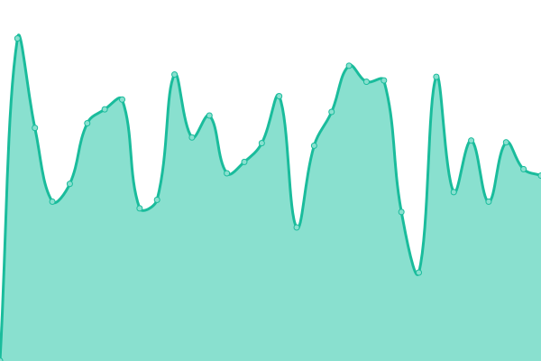
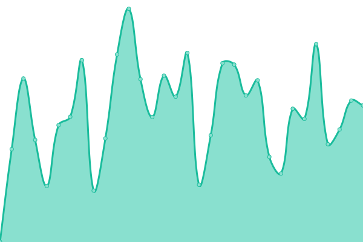
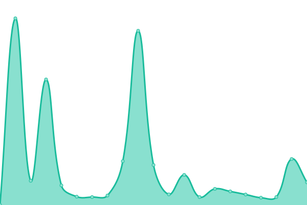

# [📈 Live Status](https://demo.upptime.js.org): <!--live status--> **🟩 All systems operational**

This repository contains the open-source uptime monitor and status page for [Haoyu Chen](https://blog.null-qwerty.work), powered by [Upptime](https://github.com/upptime/upptime).

With [Upptime](https://upptime.js.org), you can get your own unlimited and free uptime monitor and status page, powered entirely by a GitHub repository. We use [Issues](https://github.com/null-qwerty/status/issues) as incident reports, [Actions](https://github.com/null-qwerty/status/actions) as uptime monitors, and [Pages](https://demo.upptime.js.org) for the status page.

<!--start: status pages-->
<!-- This summary is generated by Upptime (https://github.com/upptime/upptime) -->
<!-- Do not edit this manually, your changes will be overwritten -->
<!-- prettier-ignore -->
| URL | Status | History | Response Time | Uptime |
| --- | ------ | ------- | ------------- | ------ |
|  [blog](https://blog.null-qwerty.work) | 🟩 Up | [blog.yml](https://github.com/null-qwerty/status/commits/HEAD/history/blog.yml) | 

 854ms
     
 | 

<a href="https://status.null-qwerty.top/history/blog">99.40%</a>
    

|  [images](https://images.null-qwerty.work/large_evcg11c.png) | 🟩 Up | [images.yml](https://github.com/null-qwerty/status/commits/HEAD/history/images.yml) | 

 757ms
     
 | 

<a href="https://status.null-qwerty.top/history/images">100.00%</a>
    

|  [images-jsdelivr](https://cdn.jsdelivr.net/gh/null-qwerty/images@main/large_evcg11c.png) | 🟩 Up | [images-jsdelivr.yml](https://github.com/null-qwerty/status/commits/HEAD/history/images-jsdelivr.yml) | 

 273ms
     
 | 

<a href="https://status.null-qwerty.top/history/images-jsdelivr">100.00%</a>
    

<!--end: status pages-->

[**Visit our status website →**](https://demo.upptime.js.org)

## 📄 License

- Powered by: [Upptime](https://github.com/upptime/upptime)
- Code: [MIT](./LICENSE) © [Anand Chowdhary](https://anandchowdhary.com), supported by [Pabio](https://pabio.com)
- Data in the `./history` directory: [Open Database License](https://opendatacommons.org/licenses/odbl/1-0/)
